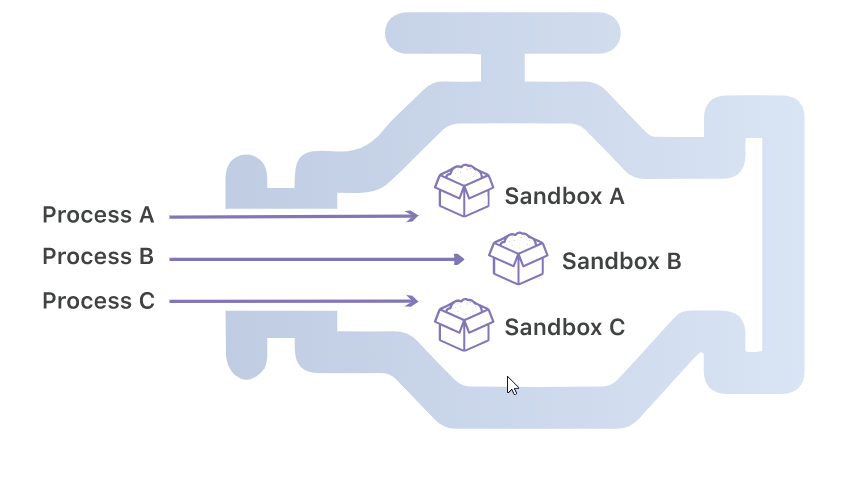

# Node.js

Nodejs JavaScript kodlarını execute etmek için yapılmış, açık kaynak kodlu bir runtime environment'tır ve Chrome V8 Engine motoru üzerine inşa edilmiştir.

## Chrome V8 Engine

- Chrome V8 JavaScript engine'idir. Yani JavaScript kodlarını çalıştırır. Aslında JavaScript web browserlarında çalıştırılabilmek için çıkmıştır, fakat V8 browser içinde veya dışında JavaScript kodunu çalıştırabilir.

- Chrome V8 güçlü ve hızlıdır. JavaScript kodunu makine koduna çevirir, bilgisayarlar bunu anlar.
  - Makine kodu CPU'nun anlayabileceği bir dildir.

### Sandboxing

Diğer ortamlardan izole edilmiş ve bölümlenmiş yazılımları çalıştırmak için kullanılan bir ortamdır.

- Sandboxing, Chrome V8'in önemli bir özelliğidir. Her process sandboxa alınır. Bu da JavaScript fonksiyonlarının ayrı ayrı execute edildiğini, bir kodun diğer kodu etkilemeyeceğini gösteriyor.
  - Genelde sandboxing yapan makineler, virtual makineler düşük performans veriyorlar, fakat V8 düşük bir performans göstermiyor.

---

## Memory Management

C gibi Low-level yazılım dillerinde <code> malloc(), free() </code> gibi metotlarla memory management yapılıyor. JavaScript ise bunu objeler oluşturulduktan sonra kullanılmadığında otomatik olarak yapıyor. Buna <b> Garbage Collection </b> deniliyor. Bu developerlarda memory management yapmalarına gerek olmadığına dair kafa karıştırıcı bir şey düşündürebiliyor.

### Memory Life Cycle

Programlama dilinden bağımsız, memory life cycle neredeyse aynıdır.

1. İhtiyaç olan belleği ayırın.
2. Ayrılan belleği kullanın.
3. Ayrılan belleği artık.gerekmediğinde serbest bırakın.

---

## Senkron ve Asenkron

### Senkron

Adından da anlaşılacağı gibi, eşzamanlı bir sırada olmak anlamına gelir, yani kodun her bir kısmı birer birer yürütülür. Bu nedenle, temel olarak bir ifadenin, önceki ifadenin yürütülmesini beklemesi gerekir.

- Senkron kod belirli bir sırada yürür
- Her işlem, bir önceki işlemin execute edilmesini bekler.
- Çoğunlukla, JavaScript senkron kod çalıştırır.

### Asenkron

Programın, eşzamanlı kodun mevcut kodu bitirene kadar kalan kodun daha fazla yürütülmesine olanak tanır.

- Eşzamansız koddaki talimatlar paralel olarak yürütülebilir.
- Sonraki işlem, önceki işlem işlenirken gerçekleşebilir.
- Asenkron JavaScript, yürütmenin süresiz olarak engellendiği durumlarda tercih edilebilir.

---

## Event Loops

JavaScript kodu execute etmekten, event toplamak ve işlemekten, queue (sıra - kuyruk)'da olan görevleri yönetmekten sorumlu bir olay döngüsüne dayalı bir çalışma modeline sahiptir. Bu <b> olay döngüsüne </b> dayalı çalışma modeline <b> Event Loop </b> diyoruz. Bu olay C ve Java gibi programlama dillerinden biraz daha farklıdır.

<code> 
function foo(b) { 
  const a = 10; 
  return a + b + 11; 
} 
 
function bar(x) { 
  const y = 3; 
  return foo(x * y); 
} 
 
const baz = bar(7); // assigns 42 to baz
</code>

 

Fonksiyonlar stack frame'lerden çağırılıyor.

1. <b>bar()</b> çağırıldığında, <b>bar</b>'ın parametrelerinin referansınlarını ve local variable referanslarını tutan bir frame oluşturuluyor.
2. <b>bar(), foo()'yu çağırdığında</b>, birinci frame'in üstüne ikinci bir frame oluşturuluyor. Bu frame foo'nun parametrelerinin referanslarını ve local variable referanslarını tutuyor.
3. <b>foo() return edildiğinde</b>, stack'in en üstündeki eleman ayrılıyor.
4. <b>bar() return edildiğinde</b>, stack boş kalıyor.

Unutmamak lazım, parametreler ve local variable'lar bulunmaya devam edebilirler, sadece stack'in dışında tutulurlar. Yani hala accessible kalırlar.

> Object tipi, daha büyük çoğunlukla yapılandırılmamış bir bellek bölgesi olarak <b>heap</b>'te tutulur.

> İşlenecek mesajlar listesi olarak <b> message queue </b> kullanılır. Her mesajın, mesajı işlemek için çağrılan bir işlevi vardır.

> Event Loop sırasında çalışma zamanı, en eski iletiden başlayarak queue'daki iletileri işlemeye başlar. Bunu yapmak için mesajdan queue kaldırılır ve karşılık gelen işlevi, bir giriş parametresi olarak mesajla birlikte çağırır.

> Fonksiyonlar, yığın boşalana kadar devam eder. Ardından, event loop, queue'da bulunan bir sonraki iletiyi işleyecektir.

---

## Blocking vs. Non-Blocking

> Blocking, Nodejs işleminde ek JavaScript'in yürütülmesinin JavaScript olmayan bir işlem tamamlanana dek beklemesi gerektiği zamandır. Bunun nedeni, olay döngüsünün engelleme işlemi gerçekleşirken JavaScript'i çalıştırmaya devam edememesidir.

- Nodejs'de I/O gibi JS olmayan bir işlemi beklemek yerine CPU'nun yoğun olması nedeniyle düşük performans sergileyen JS'e genellikle blocking adı verilmez. Nodejs standart kitaplığında libuv kullanan senkron, en sık kullanılan engelleme işlemleridir. Yerel modüller ayrıca engelleme yöntemlerine sahip olabilir.

- Blocking metotlar senkron, non-blocking mehodlar asenkron çalışırlar.

### Never Blocking

Event Loop'un ilginç bir özelliği de diğer birçok dilin aksine JavaScript'in asla engellenememesidir. <b> I/O Handling </b> event ve callback'ler yoluyla gerçekleştirilir, bu nedenle uygulama database'den dönen bir sorguyu veya bir XHR isteğinin dönmesini beklerken, yine de kullanıcı girişi gibi şeyleri işleyebilir.

---

## Concurrency & Parallelism

> Concurrency, iki veya daha fazla taskı çakışan zaman dilimlerinde başlayabilmesi, çalışabilmesi veya tanımlanabilmesidir. Bu, her ikisinin de aynı anda çalışacakları anlamına gelmez. Mesela tek çekirdeği olan bir makinede multitasking yapılması.

> Parallelism, görevlerin kelimenin tam anlamıyla aynı anda, çok çekirdekli bir işlemcide çalıştığı zamandır.

- JS'de Event Loop stack'deki öğeleri non-blocking bir şekilde yürütmek için aynı anda iletiden iletiye dayanır. Yani blocking yokmuş gibi algı yaratır, normalde single-thread olduğu için kısa bir anlığına blocking yapar.

- Rust gibi diller esneklik ve güç, Go gibi diller basitlik ve performans sunarken, JS hiçbir zaman eşzamanlılık için tasarlanmamıştır. Yine de Nodejs bir anda concurrency ve non-blocking I/O'ya odaklanan bir yapı olmuştur. JavaScript Event Loop zaten bunun önünü açıyorken, Nodejs, server tarafında da concurrency sağladı. Callbacks, Promises, async/await bunu bize sağlıyor.

- Bunlara ek olarak JavaScript ile multi-thread bir şekilde eşzamanlı çalışma ve paralelleştirme yapılabilir. Rust kadar esnek, Go kadar basit olmasa da diğer dillerde mümkün olan hemen hemen her şeyi yapabilir ve iyi performans elde edeblirsiniz.

---

nodejs non-blocking, event looptur

event loop
