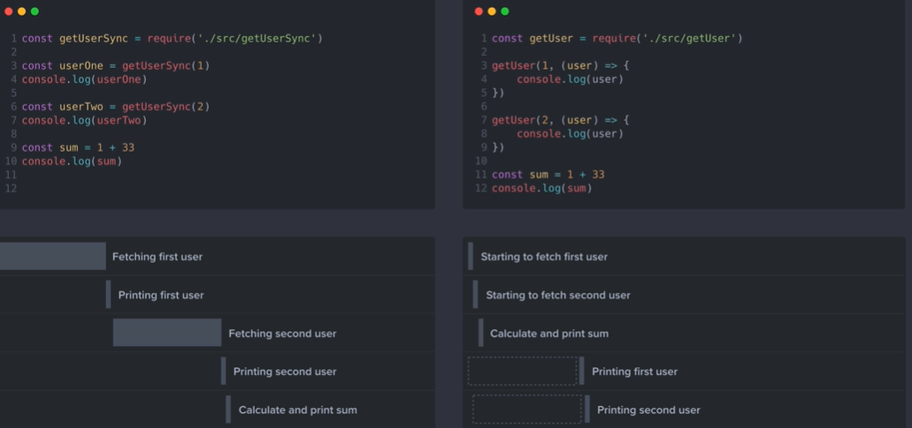
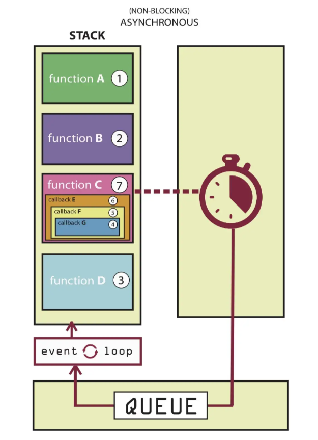

<h1> Nodejs </h1>

Nodejs is a JavaScript runtime built on Chrome's V8 JavaScript engine. Nodejs uses an event-driven, non-blocking I/O model that makes it lightweight and efficient.

V8 is a Google open source project. The job of the engine is to take in JS code to machine code. V8 Engine is written in the C++. It provides us a lot of tools, like global, process vs.

- In Chrome we can reach localStorage, document vs.
- In Node.js fs, os, process vs.
  - Actually JS don't know how to read file, but C++ does.

## Why should I Use Nodejs?

> If your node app needs to communicate with the machine it's running on, that's I/O. For example, reading a file in fs.

### Non-blocking

That means that while your node application is waiting for a response, let's say a response from that database, it can do other things. It could continue to process other code and make other requests.

- Non-blocking is actually from the browser, so non-blocking I/O started in the browser because otherwise the browser would completely freeze up whenever an I/O was happening.
  - So if I was trying to fetch some data to render it to a user while that data was being fetched, user wouldn't do able to anything.
  - We can continue do to other things for those long running I/O operations to complete.

### Blocking vs Non-blocking

First one is blocking, and second one non-blocking I/O.

- In blocking example it waits until the executed line finished the process.
- Non-blocking example doesn't wait for another line. It runs the code.

### Event-Driven

Event driven is just that process of registering those callbacks and having them called when the I/O operation is done.

---

# Javascript is Synchronous

- As its base, JS is a synchronous, blocking, single-thread language. That just means that only one operation can be in progress at a time.

What if you have to make an expensive database request? You don’t want to be twiddling your thumbs while PG and Postgres grab those 800 songs you need for your music library. Synchronous code makes a programmer’s life very difficult, so the JavaScript community developed some great workarounds.

When you hear folks say that JavaScript is an asynchronous language, what they mean is that you can manipulate JavaScript to behave in an asynchronous way. It’s not baked in, but it’s possible! Here are a few ways to make that happen:

### Asynchronous Callbacks

Let’s use a database request as an example: asynchronous callbacks allow you to invoke a callback function which sends a database request (and any other nested callbacks) off to your app, where it waits for a response from the database, freeing up the rest of your code to continue running.

Once the database request completes, the results (and any other nested code) are sent to the queue and then processed through the event loop.

In the diagram here, you can see how this differs from the synchronous code. Function C, along with E, F and G are all sent off to the browser, queue and event loop.

> <a href="https://www.youtube.com/watch?v=8aGhZQkoFbQ">If you want a wonderful, clear explanation of this process, check out this demonstration by Philip Roberts.</a>

### Promises

With a promise, instead of bundling all dependencies into one code block and sending the entire thing off to the browser, we're able to seperate them out.

We can send the asynchronous callback to the browser and user <code> .then() </code> to hold all other dependencies aside, running them only once Function C returns and runs.

This allows us to code in more modular, readable way, while still gaining the benefits of asynchronous programming.

### Async / Await

Promises were fantastic, in fact, that ES6 brought them into the language as a standard. But using promises still left asynchronous code feeling slightly wonky, so we now have the beatiful and stunning Async/Await to help us out!

- Continue using promises
- Write asynchronous code that looks and feels synchronous
- Cleans up your syntax and makes your code more human-readable.

---

### <a href="https://www.youtube.com/watch?v=8aGhZQkoFbQ&ab_channel=JSConf">Event Loop || Philip Roberts</a>

- single-thread
- non-blocking
- asynchronous
- concurrent

I have a

- call stack,
- an event loop,
- a callback queue
- some other apis

#### V8

- I have a call stack and a heap
