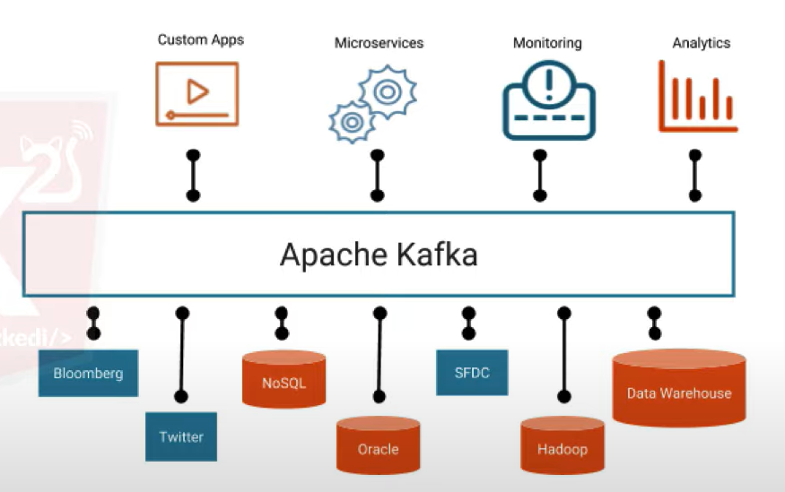
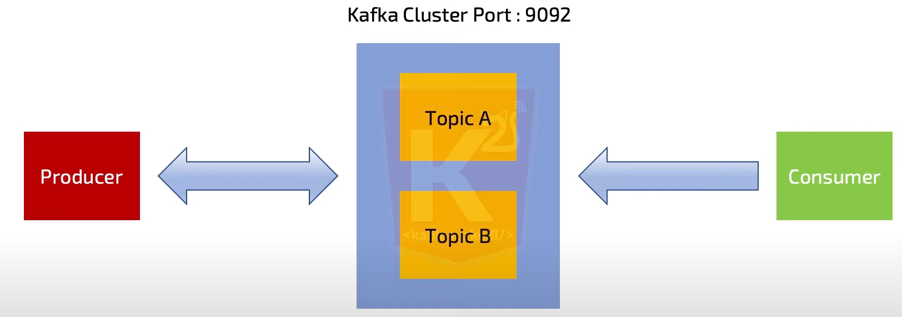
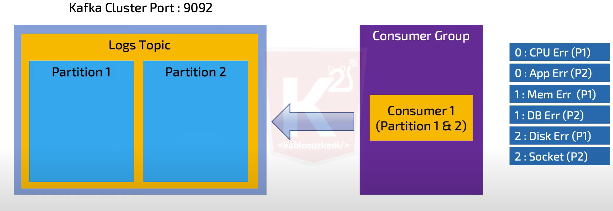
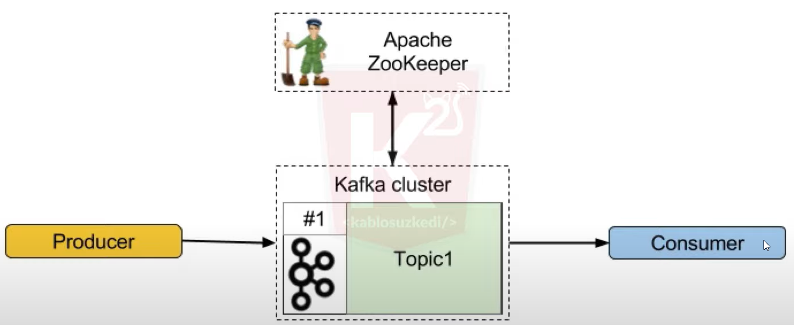
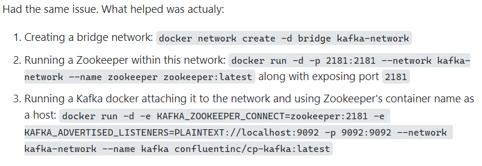

# APACHE kafka

- *Apache Kafka* bir **Message Broker** sistemi.
- LinkedIn şirketinin fonlamasıyla;
  - **2011** yılında piyasa çıkmıştır.
  - İsmini **2012** yılında Franz Kafka'dan almıştır.
- **Scala** ve **Java** ile yazılmıştır.
- Mesajlar **index** yapısına göre yazılır ve okunur, bu yüzden de hızlıdır.


### Nerelerde kullanabiliriz?



- Web sayfası etkinlik izlemelerinde
  - User interactions
  - User hashing informations
- İzleme sistemlerinde metriklerde (Grafik, CPU izlemeleri)
- Log toplama sistemlerinde
- Stream Processing işlemlerinde (Dağıtılması gereken işlemlerde)

### Kafka'nın **Artıları**

- Hızlı
  - Yüksek trafik, düşük gecikme (high throughput and low latency)
- Ölçeklenebilir
  - Node ve partition ile yatay olarak ölçeklendirilebilir.
- Güvenilir
  - Ölçeklendirilmiş ve hata tolare edebilir. (Disturbuted and fault tolerant)
- Sağlam (durable)
  - Veri kaybı yok, mesajlar disk üzerine immutable log ile yazılıyor.
- Açık kaynak (open source)

Kafkayı Uber, Netflix, Spotify, Slack, Pinterest, Coursera, LinkedIn, Shopify gibi firmalar kullanıyorlar.

## **Components**



- **Producer:** Bize Kafka'nın toplayacağı verileri gönderen yapı. Upload edilen video olabilir, log olabilir.
- **Topics:** Bizim veri depomuz, göndereceğimiz verileri depolayan birimler.
- **Kafka Broker:** Sunucunun kendisi
- **Consumer:** Topiclere bağlanan, topic'i baştan başlayarak okur.

### Nasıl Çalışıyor?

Öncelikle topic'i üretmemiz gerekiyor. Herhangi bir logu toplaması gerekiyor. Bunu da producer'dan gönderiyoruz. Consumer'ın tek yaptığı şey ise topic'e join olarak tüm indexleri teker teker okuyor. Okunacak index kalmayana kadar okuyor.

----

Topic'leri ayırabiliyoruz ve o şekilde dinleyebiliyoruz. Mesela Application, Error, Crash olarak 3 farklı topic'e ayırarak 3 topic'i ayrı ayrı dinleyebiliyoruz. Peki bunları **aynı topic içerisinde, fakat farklı yerlerde** tutmak isteseydik ne olacaktı?

- **Multi Partition:** Bu sefer de topic içerisinde partition olarak bölebiliriz.

### Kafka'da **Queue ve Pub/Sub Modelleri**

- **Queue**, mesaj 1 kere publish edilir, 1 kere consumer tarafından consume edilir. Sonra Queue üzerinden silinir.
- **Pub/Sub**, 1 mesaj publish edildiğinde, 1'den daha fazla consume edilebilir.
  - Peki neden Pub/Sub modeline ihtiyaç var?
    - Youtube'u düşündüğümüzde videoya göre çözümleme yapılıyor. Video çözünürlüğü uygunluğuna göre farklı encoder'lara gidiyor. 4K video için farklı encoder kullanılırken, 1k için farklı encoder'lar kullanılıyor.
- **Consumer Group**:
  - Partitionların paralel olarak işlenmesi için geliştirilmiş bir yapı.
  - **Normalde 1 consumer, 1 partition okumaktan sorumludur (olması gereken)**, fakat Consumer group ile bu yapı değiştirilebiliyor. Consumer group ile, Queue ve Pub/Sub metodları aynı anda sağlanabiliyorlar.



- Consumer iyi bir makine üzerinde çalışıyorsa, iyi bir **Load Balancer** ile bu yükü dağıtabiliyorsanız bu durum kullanılabilir, fakat ideal olan **1 Partition, 1 Consumer tarafından okunması**.

Optimum olan şekil;
- **Queue** gibi davranır.
- **Paralel okuma** gerçekleştirir.


Özet olarak Consumer Group'un Queue gibi davranmasını istiyorsak, tüm consumer'ları 1 grup içerisine koymalıyız.

### Topic Bazlı Dağıtık Sistem (Distributed System)

Birkaç sunucuyu aynı anca çalıştırabiliriz ve hepsi birbirinin klonunu olur. Leader ve Follower topic'ler bulunuyor. Follower olanlar, Leader'ın içine attığı mesajları kendi içine kopyalar.

Partition bazlı dağıtık sisteme de izin verir, Leader'da hata olduğunda diğer taraf Laeder oluyor.

### Veriler Nerede Tutuluyor?

**ZooKeeper**'da.

ZooKeeper sürekli Kafka Cluster'a bağlı şekilde çalışıyor. Bilgilerin tutulmasını sağlıyor. 



Gossip protokolüyle leader bulunuyor, bilgi yazılıyor. Sonrasında da Follower'a kayıt ediyor.

### Installation

```sh
docker run --name zookeeper -p 2181:2181 zookeeper
```

```sh
docker run --name kafka -p 9092:9092 -e KAFKA_ZOOKEEPER_CONNECT=127.0.0.1:2181 -e KAFKA_ADVERTISED_LISTENERS=PLAINTEXT://127.0.0.1:9092 -e KAFKA_OFFSETS_TOPIC_REPLICATION_FACTOR=1 confluentinc/cp-kafka
```



### Resources
<a href="https://www.youtube.com/watch?v=ZphPT3r6fnU&t=3s&ab_channel=kablosuzkedi">Kablosuz Kedi Youtube Videosu</a>

- <a href="https://kafka.softwaremill.com/">Kafka Software Mill</a>
- <a href="https://stackshare.io/kafka">Stackshare / Kafka</a>