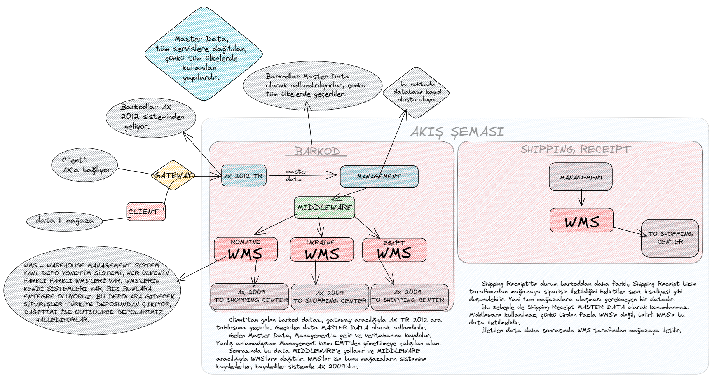

# ERDIS

- Erdis microservice mimarisiyle yönetilen bir projedir.

Bu noktada biraz mikroservice ve monolitik mimarinin ayrımlarından bahsediyor Çağrı.

## Monolitik Mimari

- Farklı teknolojiler kullanmak zor.
- Tek bir proje üzerinde çalışılır.
- Bir değişiklik tüm uygulamayı sıkıntıya sokabilir.
- Mesela payment kısmında bir değişiklik yaparsak, tüm uygulamayı tekrardan deploy etmek gerekir.
  - Deployment süreci de mikroservislere göre daha uzun sürebiliyor.

## Mikroservis Mimari

- Uygulamayı küçük parçalara bölerek çalıştırıyoruz.
- Servisler birbirinden ayrı parçalar oluyorlar, her biri farklı projede bulunuyorlar.

### Mikroservis Mimaride Servisler Nasıl Bölünür?

Teknik değil, business alanı olarak bölünmelidir.

- Bu da aslında authentication bir kısımda
- Satın alma bölümü bir kısımda gibi olmalı demek olyor.

Mikroservisdeki servisler birbirleriyle iletişim kurabiliyor olmalı. Bunun iki yolu var.

- Senkron bir iletişim olan **API Call** kullanabiliriz.
- Asenkron olarak ise **Message Broker** kullanabiliriz. Bunlar Kafka, RabbitMQ gibi teknolojilerdir.
  - Buralarda _message queue_'lar kullanılıyor.

---

## Azure DevOps

- Repos kısmından versiyon kontrolü yapılıyor.
- Management, Middleware gibi kısımlar var.
- Middleware içinde de, middleware service, middleware worker gibi çeşitli servisler bulunuyor.
- Service içerisinde veri toplanıyor, worker içerisinde ise veriler iletiliyor.
- Her bir servisin kendine ait veritabanı var.

---

## Data Akış Senaryosu

- Client, data veya mağaza olarak adlandırılabilir.
- Gateway ile kullanıcı kontrolü ve uygulamaya bağlanabiliyorlar.
- Entegrasyona bağlandıktan sonra **Colins TR AX 2012** adıyla bir ara tabloya geçiyorlar.
- Bu noktadan sonra **master data** dediğimiz bir yapıyla tüm servislere aktarımı yapılır.
  - **Master Data** tüm ülkelerde geçerli olan _barkod_ gibi yapılarda kulllanılıyor. Tüm servislere dağılımı oluyor.
  - Sonrasında Middleware ile MongoDB'ye kaydoluyor ve burdan **WMS**'e gidiyor. Bunun anlamı **Depo Yönetim Sistemi**.
  - Yani Middleware aslında ülke ülke datayı dağıtıyor.
  - Ülkeler de bu ürünü kendi depolarına (SQL) kaydediyorlar.
  - Bu şekilde Türkiye'den diğer ülkelere data gönderimi oldu.
- _Master Data_ kullanamadığımız zaman farklı bir yapıya geçiyoruz.
  - Mesela fiyat sorgusu yapıyorsak, middleware'e uğramadan direkt ülkeye gönderiyoruz.
  - Böylelikle sadece gerekli ülkeye datayı gönderiyoruz.

## WMS-Erdis-AX Data Architecture

- Data akışı gerçeklenirken **WMS Worker Service** ile Mongo'ya kaydediyoruz.
- Gateway aracılığıyla istek geliyor, burdan kendi WMS'i ile ürünü çekiyor, kopyalıyor, güncelliyor.

Depodan bir istek geldiğinde ürün çekmek için TR tüm ürünlerin deposu olduğu için AIF Scheduler'la ara tablodan ana tabloya(yani AX)'a data gönderimi oluyor.

---

## POS

- POS, TR'de mağazadan gelen istekleri içeriyor.
- Middleware kullanılmıyor, çünkü TR dataları oluyor.
- Bu barkod gibi şeyleri içermiyor, sadece fiyat gibi dataları içerir.

## WMS

- WMS'lerin kendi sistemleri, kendi managementları var. Biz bunlarla entegre oluyoruz. Bu depolar bizim değiller.
- Bu depolara gidecek siparişler TR depodan çıkıyor. Sonra ordaki dağıtım işini _OutSource_ depomuz hallediyor.
- Bu depolara barkod göndermemiz gerekiyor. Bu barkod datası TR'den çıkıyor. TR'de üretilen barkod datası farklı ülkelere dağıtılır.
  - Bu data _Master Data_ olarak adlandırılır, Middleware'de tutulur. Çoklu dağıtılır.
- Barkodlar AX 2012 sisteminden geliyor, middleware de datanın tamamını tuttuğumuz yer olarak konumlanıyor.

- Ukrayna ve Romanya'nın içerisinde ise burada bulunan mağazalara sevkiyat çıkacağı zaman ordaki işlemi Ukrayna'daki ERP hallediyor.

---

