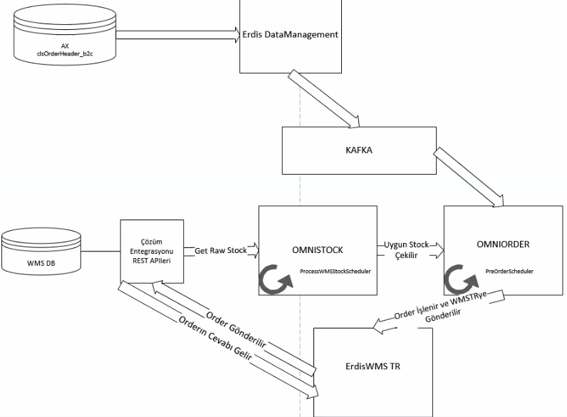

2. fazda ortak bir stok, ortak bir sipariş yapısı olsun, AX bağımsız ilerleyebilelim istedik. Depo entegrasyonlarıyla mı devam edelim stock'u mu ortak yapalım derken, stock dışarı alıncaksa order olmadan olmaz denerek, order ve stock yapılması planlandı. Ekim'e kadar yapılması planlanıyor.

Mağazacılık tarafının stock'unu da her biri depoymuş gibi kayıt altına alınarak göstermekten yanayız. Daha senkron bir yapı oluşur. Şuanda AX'ta yürüyen E-Ticaret sipariş stokları için bir stock yazıyoruz. ETicaret'te problemli bir durum olursa, depo içi çözümlerle çözebileceğimiz durumlar var.

AX entegrasyonumuz var, burada dolan tabloyu `clsOrderHeaderTable_B2C` dinliyoruz. Erdis-Data-Management'ta `stagings` tablosuna doluyor. Dolduktan sonra filtrelere uygun bir veriyse:
  - Sipariş ön siparişte mi?
  - Stoğun işlenmemiş olması?
  - Barkodun daha seçilmemiş olması?
  - Model, Renk, KaliteVersiyon bilgileri belli
Burdaki izi alıp OMNIORDERERDISQUEUE'ya gidiyor. 

Burada OMNI ORDER dinliyor. dataStaging.consumer içinde dinliyor. Buradan sonra OMNI ORDER'da preOrder.scheduler içerisinde SQL'den çektiğimiz SP ile çekiyoruz.

1. ETicaret operasyonu klasik
2. Mağazadan teslim --> ETicaretten mağazadan alabilme özelliği
3. Marketplace var ETicaret'le aynı, ama Trendyol üzerinden olursa buradan oluyor. Colins Eticaretten değil de Trendyol'dan veya N11'den falan yapılması.

Biz SP ile çekerken detayları çekmiş oluyoruz. Order'la ilgili şeyler.

Stock'un kopyasını tutuyoruz, açık sipariş olarak kalıyor. Rezerve edinceye kadar ve depoya gönderinceye kadar açık kalıyor. Depodan ne zaman ben bunu gönderiyorum diyor, o zaman sipariş status değişiyor. Ne kadar sık schedule yapılsa da 1 dakika 2 dakika gecikme olacak.

WMS'te çözüm denen bir firma var. Stoksal işlemleri falan yapıyorlar. Periyodik olarak buradan Stock'u alıp, işlenmiş stock haline getiriyoruz. `stocks` table'a baktığımzda burada hangi depoda, hangi şirkette bulunuyor gibi kodlar bulunuyor. Bunların bir de işlenmesi gerekiyor, onlar da `processedstocks` tablosunda bulunuyor. Depodan aldığımız stockları burada işledikten sonra ETicaret'in stockuna gönderiyoruz. 

ETicaret'i yapan başka bir firma biz oraya periyodik stock veriyoruz. Stock'u teyit ediyorlar bizden satarken tekrardan. Varsa da satış yapıyorlar. 

Çözüm entegrasyon API'leriyle Stock çekilmesi için yapıldı. Ham haldeki stock'u burada çekiyoruz. Sonra processWMSStockScheduler ile bizim bütün tablodaki stock'ları alıyor. Sonlarındaki key number'lara göre processLimit belirliyoruz. Her birini işlemcilere dağıtacak şekilde bölüyoruz. 8 işlemciye 100 işlemi dağıtıyoruz, her bir işlem 100'e bölümünden kalanını işliyor. 100'le 200 arasındakileri de her seferinde aynı şekilde bölerek işliyor. Burada da subProcess'ten (child process, thread bölmek) faydalanıyoruz.

- İşlemci yapısının kurulma sebebi çok fazla stock olması (27100), bunların her birini işlemek gerekiyor. Bunu yapmak için node'un stream yapısından da faydalanıyoruz. En hızlı zamanda yapılması gerekiliyor, sürekli güncelleme yapacağımız için de süreyle ilgili de bir hızlandırma sağlamamız gerekiyor.
  - WMS entegrasyonundan çekilen bir massive data var
  - Onları halledip kullanılabilir data şekline sokmak ayrı bir işlem, ve bu uzun sürmemeli.
  - Order işlenicek 1 saatte bir çekilirse, 1 saatlik stock sıkıntı vericek. En güncel stockla devam etsin istiyoruz, en yakın kopyayı almaya çalışıyoruz. Bu yüzden de böyle yapıyoruz.

Bu işlemeyi bitirdikten sonra `processstock` ortaya çıkmış oluyor. OnOrderQty varsa farklı logicler var. colorId gibi şeyler Erdis'te bulunan barcode tablosundan geliyor. 

Bir config table olmak zorunda ve burada depo olmalı. `warehouseCode`. Tanımlı olmayan bir stock'u işleyemiyoruz. SalesPoolTable ile de adres bilgilerini mapliyoruz. Sonrasnıda barcode buluyoruz, existingStock mu ona bakıyoruz. 

----

Orderın schedulerlarında biz preOrderScheduler işliyoruz demiştik, burada header bilgilerini alıyoruz dedik. Açık sipariş olarak işeniyordu. Bunların linelarında barcode bilgileri bulunmuyor, (Sadece ETicaret siparişlerin bulunmuyor.) ColorId, ItemId, size bulunan 2, 3 tip barkod bulunuyor. Sezon ve menşei de önemli. Bunlar hangi sezonda çıkıyor, sezon bilgisinin tutulduğu bir yapı var. Bir de countryOfOrigin olan menşei vardır. TR'de üretilene farklı, Mısır'da üretilene farklı barcode basılır. uniqueDescription bile değiştiği için iki farklı barcode olabiliyor. İkisinden de varsa ilk bulduğun kayıdı getir diyoruz. Yoksa ötekini işle diyoruz. ETicaret siparişlerinde her ürün line olarak işaretlenir.

Buraya kadar barcode yoktu, sonra reverseECommerce diye bir fonksiyon çağırdık, gidiyor modele uygun şekilde orderLine'ları yolluyor.

Burada omni stock içerisine gidiyoruz. api içinde order.js buluuyor. Burada barcode'ları alıyoruz bir şeylere bakıyoruz. reserveStock içine veya unavailableStock içerisine pushluyoruz. İki uzunluk aynıysa success dönüyoruz, değilse availableQty'i arttıyoruz.

omni order içerisinde ise bunlara göre erdisWMSTR'ye yolluyoruz. Şu an sadece TR için yapılıyor.

---

Bir de bunun depoyla olan entegrasyon tarafı var. Şimdiye kadar yaptıklarımız sanalda. Order'ı oluşturduk falan, ama bunların hepsi bizim tarafımızda, deponun sipariş olduğundan dahi haberi yok. Bu kısımdan sonra artık deponun ETicaret tarafına bakıyoruz.

shippingOrder controller'lar erdisWMSTR içerisinde apiqueues dataları soruyor alıyor getiriyor, commitController'da ise commit edildiğinde kafkaya commit edilen datanın id'sini yolluyoruz. Bu işlem order'ın gönderim işlemine ait. CommitController'la aldığını onaylıyor.

Sonra omni order'da dinliyoruz ve orderService'ten findOne diyerek stockService'e buluyoruz. Order'ın cevabı geliyor. Geldikten sonra bizim taraftaki satışa gidip açık siparişi, satış siparişine çeviricez. AX'ta oluşan kaydı da satış siparişine çeviricez. Muhaseleşmesi için de AX'ta bir şeyleri düzenlicez.

---

- dto hangi alanların hangi pipe'a istinaden çıkacağını ve ne göndereceğini belli eden modeller. servis içerisinden aldığın ve dönüştürdüğün modeller