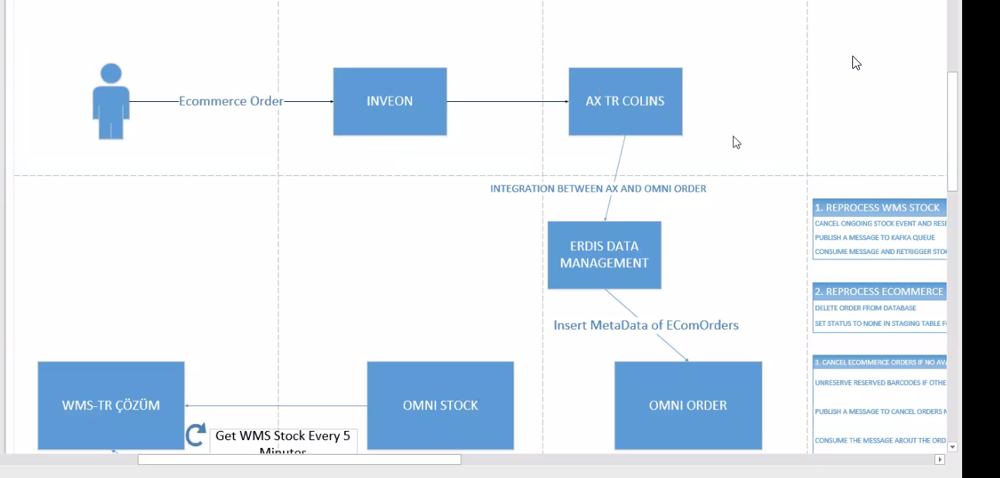

# OmniOrder & OmniStock Süreç Aktarımı



Müşteri e-ticaret sitesinden INVEON aracılığıyla siparişini veriyor. INVEON AX'taki clsOrderHeaderTable_B2C tablosuna bu siparişi yazıyor. Mağazadan teslim de buradan çalışıyor. Biz buradan dinlediğimiz status Açık Sipariş ve Satış Siparişi alanı. 

- Açık sipariş demek 
  - Öncelikle stoklarda rezervesi yapılıyor.
  - Barkodlar çıkmıyor, ama bu özelliklere ait sezon ve ürün belli. Depoda bu özelliklere uygun bir barkod bulunuyor. 

Biz bu tabloyu Midax Sender'dan dinliyoruz. Midax Sender'dan Erdis Integration Queue tablosuna ekleme yapılıyor. ErdisDataManagement içerisinde erdis.getQueue SP'sini çalıştırarak Staging'e kayıt ediyoruz.

Sonrasında burada dataListener içerisinden dinlemektense, orayı daha fazla yavaşlatmamak adına eCommerceOrder dosyasından dinliyoruz.

Biz buradaki AX kısımlarını atlayarak mağazadan teslim senaryosuna gittik, fakat şuanda AX'taki faturalandırma kısımlarını da yapmamız gerekiyor. 

- StoreOrder, mağazadan teslim oluyor.

Güncel stok şu anda depodaki WMS'yi yöneten Çözüm firmasının API'sinden alıyoruz. OmniStock içerisinde getWMSStock dosyasında 5 dakikada bir çalışan bir listener ile depodan bize akan bir veri oluyor. Burada da gateway'e istek atan bir yapı kurup, gateway'den buraya akan bir yapı kurmamız gerekiyor. 300_000 datayı 20 saniyede içeri çekebiliyor.

Bu kısma kadar sadece depodan veri alınan kısmı işledik, sonrasında burayı kendi stoğumuza çevirmemiz gerekiyor. Bunu yaparken de sizeId, colorId, qualityVersion gibi alanlarımız yok WMS'te. Barcode tablosundan bu propertyleri buluyoruz. Sonrasında locationId value'larını stockconfigtables tablosunda tutuyoruz. Biz cari kodlarını burdan görüyoruz.

WMS stoklarının stoklara dönüşme kısmında processWMSStock dosyasına bakıyoruz. Burası paralel programlama ile yapıldı. Burada StockLockStatus'ü WMS'ten aldığımız için bunların periyodları birbirleriyle çakışırsa, availableQty'nin hesaplanmasını WMS stoklardan buluyor, WMS stoğu yoksa önce orayı kitliyoruz. Onlar şuan işleniyor onlar işlendikten sonra sen onları işleyebilirsin diyor.

Depo içinde adresler destinationId, packageNo, declerationNo alanlarında tutulur, bunlar e-ticaret depoları için boştur. Bunlar depodaki adres konum bilgileri.

Sonrasında işlemeye başlandığında available, blocked gibi Qty'leri 0'a çekiyoruz. Bunu deponun bize gönderdiği kayıtlarda deponun Qty'si 0'a düştüyse depo göndermiyor, çünkü bu şekilde çok kayıt var. stock'un sıfırlandığını anlamak için biz bu Qty'leri 0'a çekiyoruz. 

Sonrasında scale modunu çalıştırıyoruz. Burada ne kadar döküman var buna bakıyor, sonrasında bu 100_000 varsa bölerek gidiyor ve cpuCount'u kadar limit oluşturuyor. Her bir çekirdeğe 10 adet işlem atadınız, bu 8'le 10'u çarparak toplam limitini 80 yapıyor.

```
[ProcessLimit/WorkerNum] - 0 - 1 - 2 - 3 - 4 - 5 - 6 - 7

```

Burada scale'leri 1.ye yolladık, bunları rawDataStock diye bir fonksiyon çağırıyor, WMS'teki ham datayı stock datasına çeviriyor.

> toArray() kullanmazsak, stream olarak dinliyoruz, her aldığımız datayı Transform'a ve Writable'a gönderiyoruz, ordan pipeline'a gönderiyoruz.

Transform kısmında bir $mod mantığı var. 100000 verimiz var demiştik. Bu 100000'i 10000'e böldük 8 tane process'imiz vardı.