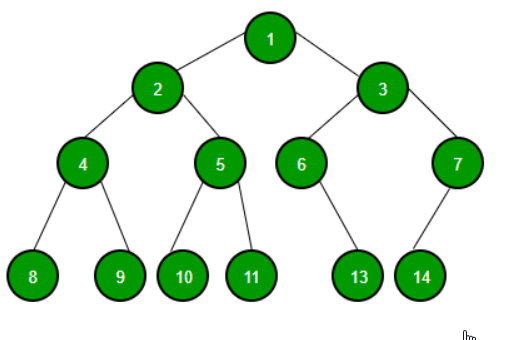

# Trees

A data structure that  consists of nodes in a **parent / child** relationship.

- **Lists - Linear**
- **Trees - Nonlinear**

## Tree Terminology 
- **Root** - The hop node in a tree.
- **Child** - A node directly connected to another node when moving away from the *root*.
- **Parent** - The converse notion of a child.
- **Siblings** - A group of nodes with the same parent.
- **Leaf** - A node with no children.
- **Edge** - The connection between one node and another.

## Uses For Trees

Lots of different applications!
- HTML DOM
- Network Routing
- Abstract Syntax Tree
- Artifical Intelligence
- Folders in Operating Systems
- Computer File Systems

## Kinds Of Trees
- **Trees**
- **Binary Trees**
- **Binary Search Trees**

### Trees
- Each node could have any number of child nodes.
### Binary Trees
- Each node can have at most two children.
## Binary Search Trees
- BSTs are a special case of a binary tree, which is a type of a tree.
- At most have two children per node, zero, one or two children.
- Top of that BSTs are sorted in a particular way.
- BSTs are used to store dataa that can be compared that is sortable.

## How BSTs WORK?
- Every parent node has at most **two** children.
- Every node to the left of a parent node is **always less** than the parent.
- Every node to the right of a parent node is **always greater** than the parent.