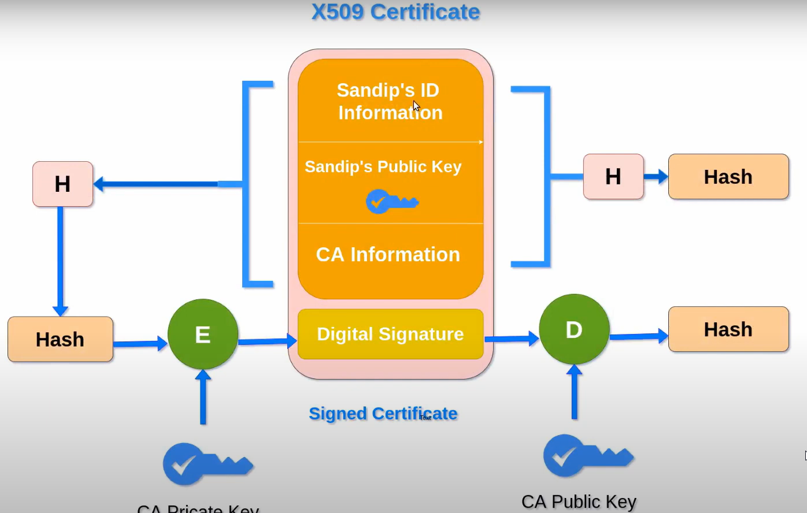
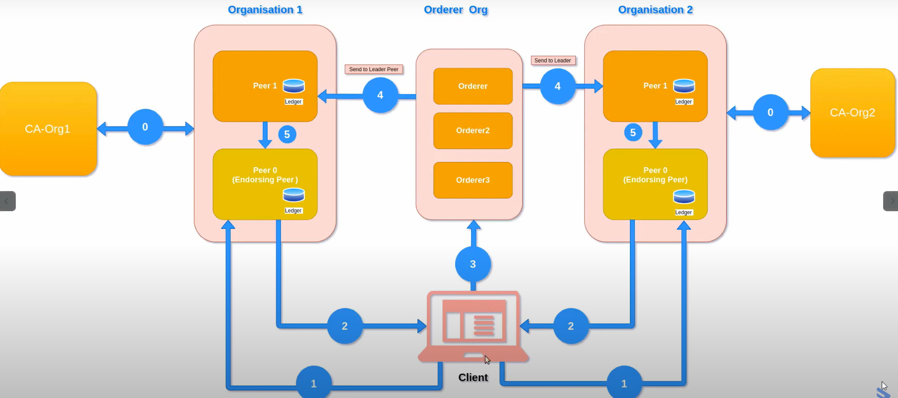

# Create Basic Hyperledger Network

setxkbmap tr

## Installation

- sudo apt-get install curl
- sudo apt-get install golang
- export GOPATH=$HOME/go
- export PATH=$PATH:$GOPATH/bin

- sudo apt-get install nodejs
- sudo apt-get install npm
- sudo apt-get install python

### Install and Upgrade docker and docker-compose

- curl -fsSL https://download.docker.com/linux/ubuntu/gpg | sudo apt-key add -
- sudo add-apt-repositoy "deb [arch=amd64] https://download.docker.com/linux/ubuntu
- $(lsb_release -cs) stable"
- $ sudo apt-get update
- $ apt-cache policy docker-ce
- sudo apt-get install -y docker-ce
- sudo apt-get install docker-compose
- sudo apt-get upgrade

- `in test-folder`
  - curl -sSL https://bit.ly/2ysb0FE | bash -s -- <fabric_version> <fabric-ca_version> <thirdparty_version>
    - 2.0.1
    - 1.4.6
    - 0.4.18

---

## Purpose of Binaries

in fabric-sample folder there is a `bin` folder. so we can add this folder to the path and we can reach them.

add the `export PATH=$PATH/home/vagrant/own-samples/hyp-youtube/testfolder/fabric-samples/bin` to `~/.bashrc`

- Configtxgen - Creating network artifacts _(`genesis.block` / `channel.tx`)_
- Configtxlator - Utility for generating channel configuration (updating channel tx)
- Cryptogen - Utility for generating key material (certificates)
- Discovery - Command line client for service discovery
- Idemixgen - Utility for generating key material to be used with identity mixer MSP
- Fabric-ca-client - Client for creating registernig and enrolling user

## Folder Structure

- ### api-2.0
  - There are multiple js files.
  - These will used when we write api.
- ### artifacts
  - Most important folder in the fabric network.
  - There are subfolders.
    - channel
      - `configtx.yaml`, `crypto-config.yaml`
      - There are genesis.block, channel.tx, org1MSP anchor, org2MSP anchor / We don't have them yet.
      - `/config` folder
        - `configtx.yaml, core.yaml, orderer.yaml`
          - core.yaml file one of the important file. **network settings**
      - `crypto-config` folder will be created aswell.
    - src
    - docker-compose.yaml
    - base.yaml
    - network-config.yaml - require for writing api on node
    - org1.yaml

## Network Details

- We'll have two organizations
- There will be two peers in each organization.
- One CA (Certification Authority) for each organization.
- We'll use orderer as a RAFT. There will be 5 orderer.
- State database will be **Couch DB**

> We are not using seperate CLI container for invoking transactions.

**Network Structure**


## Organization Structure

In `channel/crypto-config/peerOrganizations`, there are subfolder for each organization. In this folder there are:

- ca - certification authority
- msp
  - admincerts,
  - cacerts,
  - keystore, - where the private key
  - signcerts
  - tlscacerts
- peers - we'll have two peers in each organization
- tlsca
- users - by default there will be admin user
  - Admin have two subfolder msp and tls
    - tls will have ca.crt, client.crt, client.key, there are used for transport layer security communication.

---

> You can see important files in this link.
> <a href="https://github.com/erenyusufduran/colins-path/blob/main/09-blockchain/01-hyperledger/03-youtube/files.md">

- crypto-config.yaml, configtx.yaml, create-artifacts.sh, docker-compose.yaml, createChannel.sh</a>

---

## Anchor & Leader Peer

There are two types of the peer.

- **Leader Peer**:
  - It pulls the data from ordering service, later on disseminate that data to all the peer within the same organization.
  - Election is a mechanism which will maintain the connection between the ordering service and get the block and distribute that block to all the peers within the same organizations.
  - Election types:
    1. **Static**, means administrator manually configure a peer in an organization. Defining in `core.yaml`
    2. **Dynamic**, means peer execute a leader election and select one of the leader in organization. / Under gossip, there is useLeaderElection: true
- **Anchor Peer**
  - Use by gossip to make sure peers in the different organization know each other.
  - Main purpose is _peer discovery_.

## Chaincode Lifecycle

1. **Package**
2. **Install**
3. **Query**
4. **Approve**
   - Each organization need to approve that chaincode lifecycle endorsement policy. Signature policy. Once the chaincode approved, we can commit the chaincode.
5. **Check Commit Readiness**
6. **Commit**
7. **Query Committed**
8. **Invoke Init**
   - That means chaincode instantitated.
9. **Invoke**
10. **Query**

### `deployChaincode.sh`

0.  run `presetup`
1.  `packageChaincode`
2.  `installChaincode`
    - docker cantainers should be running.
    - install chaincode for each peer.
3.  `queryInstalled`
4.  - `approveForMyOrg1`
      - `checkCommitReadyness`
        - it will saye Org1MSP: true, Org2MSP: false. So we should approve for Org2
    - `approveForMyOrg2`
      - `checkCommitReadyness`
        - it will saye Org1MSP: true, Org2MSP: true.
5.  `commitChaincodeDefinition`
6.  `queryCommitted`
    - Committed chaincode definition for chaincode 'fabcar' on channel 'mychannel':
      - Version: 1, Sequence: 1, Endorsement Plugin: escc, Validation Plugin: vscc, Approvals: [Org1MSP: true, Org2MSP: true]
7.  `chaincodeInvokeInit`
    - **I am getting error it's here and then, this error comes through.**
    - initialize the chaincode
8.  `chaincodeInvoke`
    - Then we can look at <a href="http://localhost:5984/_utils">CouchDB</a>
9.  `chaincodeQuery`

---

## RAFT

Coming to agreement, or consensus, on that value is easy with one node. But how do we come to consensus if we have multiple nodes?

That's the problem of distributed consensus. **Raft** is a protocol for implementing distributed consensus.

A node can be in 1 of 3 states:

```
    - Follower
    - Candidate
    - Leader
```

All nodes start in the follower state. If followers don't hear from a leader then they can become a candidate. The candidate then requests votes from other nodes. Nodes will reply with their vote. The candidate becomes the leader if it gets votes from a majority of nodes. This process is called _Leader Election_.

All changes to the system not go through the leader. Each change is added as an entry in the node's log. This log entry is currently committed so it won't update the node's value. To commit the entry the node first replicates it to the follower nodes then the leader waits until a majority of nodes have written the entry. The entry is now committed on the leader node and the node state is **5**; The leader then notifies the followers that the entry is committed. The cluster has now come to consensus about the system state. This process is called _Log Replication_.

This election term will continue until a follower stops receiving heartbeats and becomes a candidate.

---

## CA


Right now we have 3 certificate authority. **Org1-CA**, **Org2-CA**, **Orderer-CA**

Most of the important thing in Hyperledger Fabric is _certificate validation_. Before going to the certificate validation, we should be aware of _Encryption_ & _Hashing_.

- **Encryption**: Encryption is the process of converting plane text into the cypher text.
  - Symmetric: We encrypt the text using some particular key.
  - Asymmetric: User will have two keys, _public & private_ key. So that user can encrypt that text using one of the key, and decrypt with the other key.
- **Hashing**: Hashing is the irreverseble function. Once we create the hash, we can not recall it.



Here is the X509 standard certificate. CA Information who have sign certificate.

Let's assume we have created the certificate for the Org1 and in our network we have one CA for Org1, that is the dedicated CA for Org1. CA created this certificate.

- CA firstly create hash function with _ID_, _Public Key_, _CA Information_.
- CA encrypt these hash with CA private key and put it as _Digital Signature_.
- Finally **Certificate** will get created and CA will gives that authority to user.
- _If right two hash not match, it is invalid._

In Hyperledger Fabric aswell, we have all the organization's MSP information in the configuration block. So inside that MSP, we have CA information. Who has the CA for this organization.

### Tx Signature Creation (Client) & Validation (Endorsing Peer)



When client created the transaction and sign with his private key, after that client create the signature. After that along with the proposal he has the signature aswell and same to the endorsing peer.

First of all endorsing peer check the signature valid or not for this user. Because, this endorsing peer will has that MSP of that organizations and knows CA. If certificate is valid, after that endorsing peer validate if the signer of the transaction.

---

### Create Certificates with CA and Run Network

- `docker-compose up -d` - artifacts/channel
- `create-artifacts-with-ca.sh`
- Keystore to ca don't forget
- Update `create-artifacts.sh` for CA
- `createChannel.sh`
- `deployChaincode.sh`

---

- take tlsCaCerts --> pem's for peers
  - `/tls/tlscacerts/`
- take certificateAuthorities for orgs
  - `/tlsca/`
