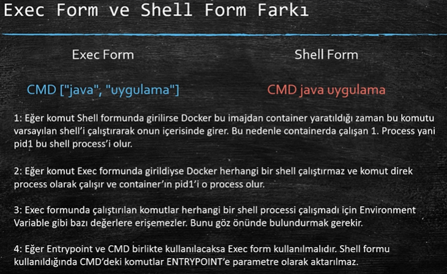

<h1> DOCKER IMAGES </h1>

Image Registry - docker hub en büyüğüdür. Aksini belirtmedikçe docker hub ile iletişime geçilir.

docker image'ına verilen isim o ismin nerede depolanacağına da karar veriyor.

docker.io/ozgurozturknet/adanzyedocker:latest

docker.io/ubuntu:18.04

docker image pull \_\_

---

<h2> Docker Hub </h2>

Docker image'ler Dockerfile ile yaratılıyor. Burdaki kodu okuyarak bu image ne yapıyor, nasıl yaratılıyor gibi bilgileri görebiliriz.

---

<h2> Dockerfile </h2>

Dockerfile kendine özgü kuralları olan bir dille yazılan ve bizlerin Docker Imageleri oluşturmamızı sağlayan dosyalardır.

<h3 align="center"> COMMANDS </h3>

- FROM image:tag

  - Oluşturulacak imajın hangi imajdan oluşturalacağını belirten talimat. Dockerfile içerisinde geçmesi mecburi tek talimat budur. Mutlaka olmalıdır.

        FROM ubuntu:18:04

- RUN

  - İmaj oluşturulurken shell'de bir komut çalıştırmak istersek bu talimat kullanılır. Örneğin apt-get install xxx ile xxx isimli uygulamanın bu imaja yüklenmesi sağlanabilir.

        RUN apt-get update

- WORKDIR folder_location

  - cd xxx komutuyla istediğimiz klasöre geçmek yerine bu talimat kullanılarak istediğimiz klasöre geçer ve oradan çalışmaya devam ederiz.

          WORKDIR /usr/src/app

- COPY source destination

  - İmaj içine dosya veya klasör kopyalamak için kullanırız

          COPY /source user/src/app

- EXPOSE port

  - İmajdan oluşturulacak containerların hangi portlar üstünden erişilebileceği yani hangi portların yayınlanacağını bu talimatla belirtiriz.

          EXPOSE 8o/tcp

- CMD command

  - Bu imajdan bir container yaratıldığı zaman varsayılan olarak çalışmasını istediğiniz komutu bu talimat ile belirlersiniz.

          CMD java hello

- HEALTHCHECK command

  - Bu talimat ile Docker'a bir containerın hala çalışıp çalışmadığınıı kontrol etmesini söyleyebiliriz. Docker varsayılan olarak container içerisinde çalışan ilk processi izler ve o çalıştığı sürece container çalışmaya devam eder. Fakat process çalışsa bile onun düzgün işlem yapıp yapmadığına bakmaz. HEALTHCHECK ile buna bakabilme imkanına kavuşuruz.

          HEALTHCHECK --interval=5m --timeout=3s CMD curl -f http://localhost/ || exit 1

<h3> Dockerfile Sample</h3>

        FROM ubuntu:18.04
        COPY ./app
        RUN make /app
        CMD python /app/app.py

<h3> Dockerfile Sample </h3>

        # Using python runtime base image
        FROM python:2.7-alpine
        # Set the app directory
        WORKDIR /app
        #Install our requirements
        ADD requirements.txt /app/requirements.txt
        RUN pip install -r requirements.txt
        # Copy code from the current folder to /app inside the container
        ADD ./app
        # Make port 8o available for links
        EXPOSE 8o
        # Define our command to be run when launching the container
        CMD ["gunicorn", "app:app", "-b", "o.o.o.o:8o", "--log-file", "-", "--access-logfile", "-", "--workers", "4", "--keep-alive", "o"]

---

Docker her image katmanına bir ID yüklediği için, dockerfile ile yaptığımız bir dosyadaki her komutu bir layer olarak alıyor, ve bu şekilde o layerları kullandığı için tekrar tekrar bir yer kaplamıyor, olanı kullanıyor. Bu da bize bant genişliği olarak dönüyor.

---

<h3> Linux Shell </h3>

- echo'yla çıktı alabiliyoruz.

        > işaretiyle farklı bir yere çıktı alabilirsin.

- echo $SHELL > deneme.txt

- & sonuna konulduğunda arkaplanda script çalışır, bizim için de konsola döner.

- ; tek bir satır içerisinde birden fazla komut girmemizi sağlar.

        ls ; date

- && birden çok komutta bir birleştirme yapar. command_one hatasız dönüyorsa, command_two'yu de çalıştırır.

        command_one && command_two

- || ile kullanırsak, hata dönerse command_two'yu çalıştır demek oluyor.

---

<h3> ADD ve COPY Farkı </h3>

ADD

- Copy ile aynı işi yapar yani dosya ya da klasör kopyalanır.
- Fakat ADD bunun yanında dosya kaynağının bir url olmasına da izin verir.
- Ayrıca ADD ile kaynak olarak bir .tar dosyası belirtilirse bu dosya imaja .tar olarak sıkıştırılmış haliyle değil de açılarak kopyalanır.

<h3> ENTRYPOINT ve CMD Farkı </h3>

CMD ile girdiğimiz komutlar Runtime sırasında değiştirilebilir. Mesela;

        CMD ["java", "merhaba"]

ile çalıştırdığımız bir imagede sonuna ls yazarsak yani;

        docker run javaimage ls

gibi şekillerde yazarsak, runtime'da değişiklik yapmış oluruz. Bunu ENTRYPOINT komutunda uygulayamayız.

- Ayrıyeten CMD ve ENTRYPOINT aynı anda kullanılırsa, ENTRYPOINT'i kullanır, CMD'deki komutu ise buna parametre olarak girer.

        ENTRYPOINT ["ping", "127.0.0.1"]

 

        ENTRYPOINT ["ping"]
        CMD ["127.0.0.1"]

Yalnız komut satırında runtime esnasında 8.8.8.8 gibi bir komut girersek CMD'deki komutu almayacak, bizim parametre olarak girdiğimiz komutu alacaktır.

---

1. Her Docker imajında bir CMD veya ENTRYPOINT talimatı bulunmalıdır.

2. Her iki talimat da bu imajdan container yaratıldığında çalıştırılacak uygulamayı belirtmemizi sağlar.

3. ENTRYPOINT ile girilen komut runtime'da yani container çalıştırılırken değiştirilemez. CMD ile yazılan ise runtime'da değiştirilebilir.

4. ENTRYPOINT ve CMD aynı anda kullanılırsa CMD'de yazılan ENTRYPOINT talimatında yazılana parametre olarak eklenir.

<h3> EXEC & SHELL Farkı </h3>

Komutları parantezler içinde yazmaya exec formu, direkt komut şeklinde yazmaya ise shell formu diyoruz.

Shell formunda ENTRYPOINT'e parametre olarak gidemez.

- Exec direkt process çalıştırır
